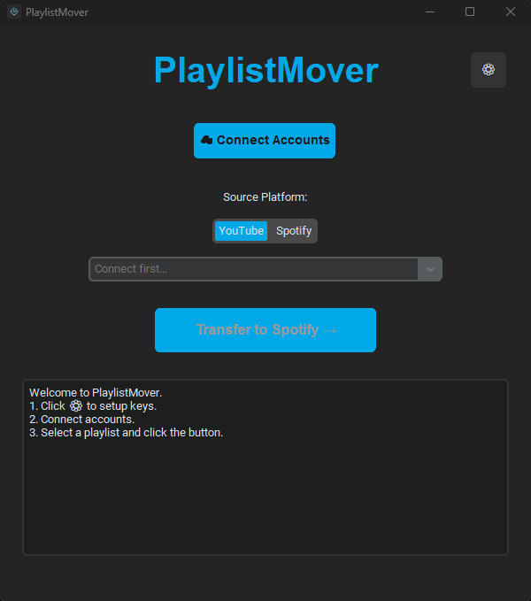

# PlaylistMover 🎵☁️

**PlaylistMover** is a modern, open-source desktop application designed to transfer music playlists between **YouTube** and **Spotify** with high accuracy.

It features a **"Smart Match"** algorithm that filters out garbage text (like "Official Video", "4K", "Lyrics") and verifies Artist names to ensure the songs transferred are the correct ones.

## ✨ Features

*   **Sky Blue UI:** Modern, centered, and clean dark interface.
*   **Two-Way Sync:** 
    *   YouTube ➡️ Spotify (High accuracy)
    *   Spotify ➡️ YouTube (Create playlists from your library)
*   **Smart Search:** Validates song titles and artist names to prevent wrong matches.
*   **Multi-Language:** Fully localized in 🇺🇸 **English**, 🇷🇺 **Russian**, and 🇺🇦 **Ukrainian**.
*   **Privacy Focused:** Uses **your own** API keys. No third-party servers involved.
*   **Loss Report:** Shows exactly which tracks couldn't be found so you can add them manually.

## 🚀 How to Install

1. Go to the **[Releases](../../releases)** section on the right side of this page.
2. Download the latest `PlaylistMover.zip` or `PlaylistMover.exe`.
3. Create a folder on your PC and place the file there.
4. Run the app.

## ⚙️ Setup Guide (Required)

To use the app, you need to provide your own API keys from Spotify and Google. This ensures you have your own personal quota limits. **It takes about 3 minutes.**

### 1. Spotify Setup 🟢
1. Go to the [Spotify Developer Dashboard](https://developer.spotify.com/dashboard/).
2. Log in and click **Create App**.
3. Give it any name (e.g., "PlaylistMover").
4. In the app settings, find **Redirect URIs** and add: 
   `http://127.0.0.1:8888/callback`
5. Click **Save**.
6. Copy the **Client ID** and **Client Secret**.

### 2. YouTube Setup 🔴
1. Go to the [Google Cloud Console](https://console.cloud.google.com/).
2. Create a **New Project**.
3. Go to **APIs & Services** -> **Library**.
4. Search for **YouTube Data API v3** and click **Enable**.
5. Go to **Credentials** -> **Create Credentials** -> **OAuth client ID**.
6. Select **Desktop App** as the application type.
7. Click **Create** and **Download JSON**.
8. Save this file on your computer.

### 3. Final Step
1. Open **PlaylistMover**.
2. Click the **Settings (⚙)** icon.
3. Paste your Spotify keys and select the YouTube JSON file.
4. Click **Save**.
5. Click **Connect Accounts** and log in via the browser.

---

## ⚠️ Limitations
*   **YouTube Quota:** Google allows free accounts to perform limited operations per day. You can transfer approximately **60-70 songs per day** from Spotify TO YouTube. But I was able to transfer my entire playlist of 319 songs.
*   **Unlimited:** Transfers FROM YouTube TO Spotify are cheap on quota, so you can transfer thousands of songs.

## 🛠 Technologies
*   Python 3.10+
*   CustomTkinter (GUI)
*   Spotipy (Spotify API)
*   Google Client Library (YouTube API)

---

*License: MIT*
